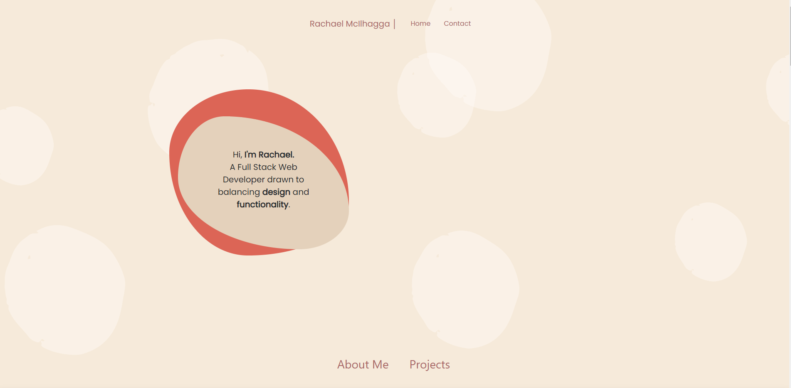
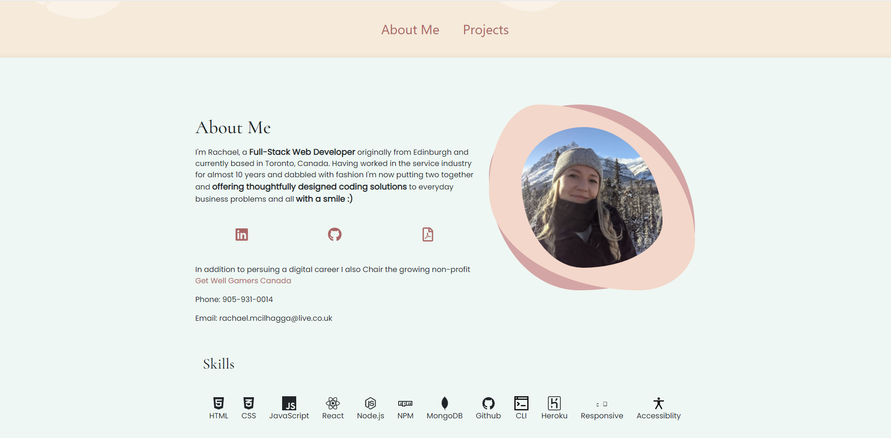
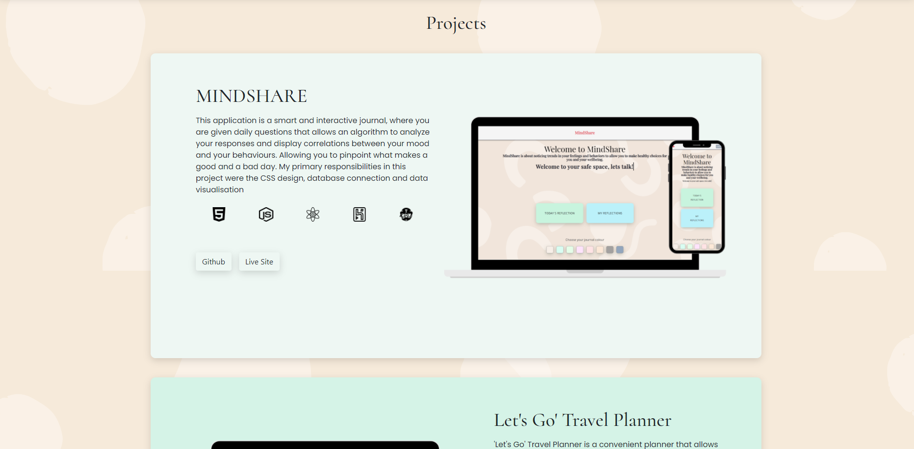
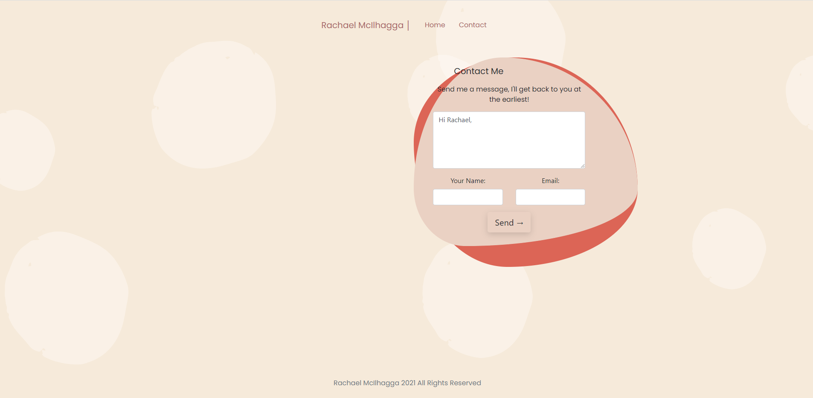

# Portfolio

## Project Description

A portfolio showcasing all of my projects written to date crated using React. 

## Screenshots

## Live Project
Thle live site can be viewed on gh pages here: https://mcilhaggis.github.io/portfolio/

## Licensing 
The licensing used for this project is MIT

## Contributions 
Author: Rachael McIlhagga
Twitter: @breadlikerach
    
## Questions
* If you have any questions about this project, please reach out to me  through <a href="https://github.com/mcilhaggis">Github</a>  or via <a href="mailto:rachael.mcilhagga@live.co.uk">Email</a>